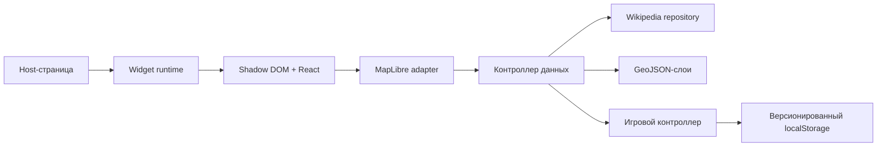

# PokeMap Widget — описание решения

## Что получилось

PokeMap — встраиваемая карта-игра на React 18, TypeScript и MapLibre GL JS.
Виджет сам находит асинхронно появляющийся слот конструктора, загружает точки из
Wikipedia GeoSearch, отмечает доступные объекты и сохраняет игровой прогресс в
браузере. Production-поставка состоит из одного IIFE-файла вместе с React,
MapLibre, worker и стилями.

В интерфейсе доступны:

- пресеты Москвы и Санкт-Петербурга;
- перемещение игрока панорамированием карты или через кнопку «Я здесь»;
- автоматический сбор точек в настраиваемом радиусе;
- очки, комбо, заморозка комбо и сброс прогресса;
- карточка Wikipedia с изображением, описанием и редкостью;
- дополнительный переключаемый heatmap-слой.

## Архитектура

`Widget runtime` отвечает только за публичное API, поиск слотов и жизненный
цикл экземпляров. React управляет интерфейсом, но не хранит MapLibre в state.
Императивная карта изолирована адаптером, данные и игровые правила вынесены в
отдельные модули. Поэтому расчёт расстояния, комбо, кэш и сериализацию можно
тестировать без WebGL.

## Интеграция с чужой страницей

Каждый экземпляр создаёт один корневой элемент и открытый Shadow DOM. В него
помещаются React root и локальные стили, включая CSS MapLibre. Глобальные стили
CMS не попадают внутрь, а стили виджета не влияют на соседние блоки.

Один `MutationObserver` поддерживает автоматический mount/unmount для
`[data-widget="pokemap"]`. Повторный `mount` идемпотентен. При удалении блока
отменяются запросы, timeout и animation frame, отключаются observers и
обработчики, затем вызывается `map.remove()`.

Плавающая раскладка отслеживается через `ResizeObserver`. Масштаб CSS-предков
вычисляется по отношению `getBoundingClientRect()` к layout-размеру. На его
основе корректируется pixel ratio карты, поэтому backing buffer соответствует
фактическому экранному размеру canvas при 80%, 100% и 125%.

## Данные и отказоустойчивость

Ответ Wikipedia приходит как `unknown` и проходит runtime-проверки. Невалидные
страницы и административные объекты отбрасываются независимо, поэтому одна
плохая запись не портит весь ответ.

Координаты запросов привязываются к сетке `0.06°`. Репозиторий хранит 24 ячейки
в LRU-кэше, объединяет их по стабильному ключу `источник + pageid` и допускает
только один активный сетевой запрос. Временные ошибки повторяются один раз,
устаревший запрос отменяется, а последний успешный набор остаётся на карте.

## Игровая модель

Расстояние считается формулой Haversine. Точки в радиусе собираются от ближней
к дальней, при равенстве — по стабильному ID. Базовые очки зависят от редкости,
а множитель хранится целым числом шагов по `0.2`, что исключает ошибки floating
point.

После обычного сбора комбо живёт 10 секунд. `epic` и `legendary` замораживают
его на 30 секунд, после чего остаётся полный десятисекундный интервал. Временные
состояния записываются абсолютными timestamp, а контроллер использует не более
одного timeout.

Прогресс хранится под ключом `pokemap-widget:progress` со схемой версии `1`.
Повреждённые и несовместимые данные безопасно заменяются начальным состоянием.

## Рендеринг и дополнительный слой

Точки не являются DOM-маркерами или React-компонентами. Они передаются одним
GeoJSON source и отображаются MapLibre-слоями. Редкость, доступность и факт
сбора кодируются feature properties и style expressions; обновления source
объединяются в один animation frame.

Hit-testing выполняется через `queryRenderedFeatures` с допуском 8 px вокруг
курсора. Heatmap использует тот же source, находится под интерактивными точками
и переключается через `visibility` без пересоздания карты или сетевого запроса.

Рабочий предел решения — около 20 000 накопленных и до 10 000 одновременно
видимых точек. Нагрузочный unit-тест подготавливает 20 000 feature одним
`setData`; на машине разработки он занял 9 мс. Следующий уровень оптимизации —
кластеризация, подготовка GeoJSON в Worker и затем vector tiles.

## Проверки

- 46 unit- и интеграционных тестов;
- сборка TypeScript в strict-режиме;
- один IIFE-бандл без отдельного CSS;
- пять пересборок host-блока без прироста слушателей и интервалов;
- проверка canvas при 80%, 100%, 125% и изменении ширины страницы;
- переключение городов, кэша и heatmap после стресс-теста.

Точные измерения canvas и полный список принятых решений находятся в
[`DECISIONS.md`](../DECISIONS.md).
